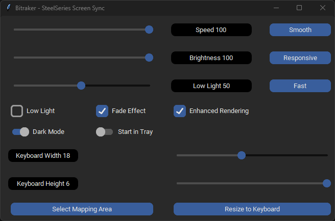

# SteelSeries Screen Sync

An unofficial application that sync screen colors with SteelSeries devices.

## Disclaimer

Written in Python3.x on a Windows machine. The application is in a very early alpha release. I have only had access to my own SteelSeries devices, consisting of a Rival 650 Mouse, QtK Large Mouse Pad and a K750 per-key illuminated keyboard. The code works in my setup on those devices. If you experience problems with your device, please open an issue, so the code can be updated.

## How it works

The application divides the lower half of the screen into a matrix of 6x22 boxes, adding up to a total of 132 boxes (this is the number the SteelSeries per-key bitmap API expects). The color of a center pixel in each of the boxes is sampled. 
The sampled colors are then applied some logic, so the screen colors can be faded, brightness can be adjusted and a low light setting can be enabled. 
The GUI is very simple and should be self explanatory.

## How to use it

There are two ways to get it up and running:
1. Download and review the code, install the required modules `requirements.txt` and run it.
2. Download the zip file containing the executable, unpack it and run the exe file `ss-screensync.exe`. It's compiled from above code using cx-freeze.

When the program runs, you should see this interface:

At this point the program should have changed your Keyboard colors (provided you own a per-key SteelSeries keyboard). If not, something is wrong.
Check the `application.log`, which is generated in the same folder as the `ss-screensync.exe` executable (or main.py file). The log is regenerated every time the program is opened.

When you close the program, you settings are automatically saved to the file `settings.json`. Those settings will be automatically loaded on startup.

The `config.json` file contains the path to the `coreProps.json` file. If your file is not in the standard location. You should edit this file to point to the correct location of the file.

## Known issues
1. Compiled code is relatively large. Perhaps the size of it can be reduced.
2. _At times the SteelSeries API seems to get confused, when opening/closing this app too fast. You can tell by the lighting effects not being applied when the app opens. The solution is to wait for ~10 seconds after closing the app, until the colors return to normal SteelSeries GameSense operation and open the app again._
3. _Sometimes it seems that the app loses connection to SteelSeries GameSense and it reverts to standard behavior. Solution is to reopen the app. I'm investigating and monitoring this, to see if the API gives an indication of this, so I can built in countermeasures, where the app re-registers itself, in case it loses connection._
4. 3 and 4 are now identified and due to SteelSeries built-in DDoS protection. It seems too strict at times. Unfortunately SteelSeries does not document, what makes it trigger other than "too many events".

## Release notes
### v0.2
- Added functionality to minimize application to system tray. This setting will be remembered, so the app automatically starts in tray, if setting is enabled.
- Improved stability
- Improved logging
